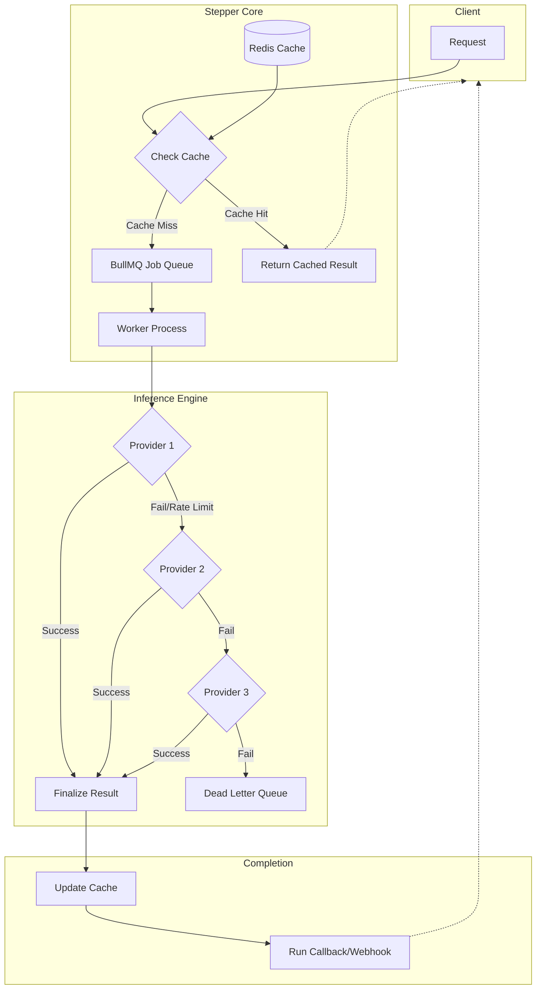
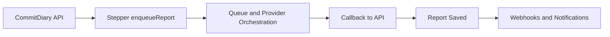

# Stepper

> AI inference orchestration for TypeScript and Node.js applications.

[](https://github.com/samuel-adedigba/ai-inference-stepper/actions)
[](https://www.npmjs.com/package/ai-inference-stepper)
[](https://www.npmjs.com/package/ai-inference-stepper)
[](./LICENSE)
[](https://www.typescriptlang.org/)

**Stepper** is a TypeScript-first AI inference orchestrator that makes AI workflows reliable under production load.
It provides queue-backed execution, Redis caching, provider failover, circuit breakers, rate limiting, and callback/webhook delivery.

## Links

- Root README: [../../README.md](../../README.md)
- CommitDiary API: [../api/README.md](../api/README.md)
- Web Dashboard: [../web-dashboard/README.md](../web-dashboard/README.md)
- VS Code Extension: [../extension/README.md](../extension/README.md)
- Core Package: [../core/README.md](../core/README.md)

## Why Stepper

AI applications frequently face provider outages, throttling, inconsistent outputs, and long-running tasks that block product flows. Stepper acts as a reliability layer between your app and AI providers.

- Handles provider fallback automatically
- Queues long-running work with BullMQ
- Uses Redis caching with stale-while-revalidate
- Applies circuit breaking and rate limits per provider
- Delivers outcomes via callbacks or webhooks

## Installation

```bash
npm install ai-inference-stepper
```

Or with pnpm:

```bash
pnpm add ai-inference-stepper
```

## Quick Start

### 1. Initialize

```ts
import { initStepper, registerCallbacks, enqueueReport } from "ai-inference-stepper";

initStepper({
  config: {
    redis: { url: "redis://localhost:6379" },
  },
});
```

### 2. Register callbacks

```ts
registerCallbacks({
  onSuccess: (jobId, provider, data) => {
    console.log(`Job ${jobId} completed via ${provider}`);
    console.log(data);
  },
  onFailure: (jobId, errors) => {
    console.error(`Job ${jobId} failed`, errors);
  },
});
```

### 3. Enqueue a task

```ts
const result = await enqueueReport({
  commitSha: "abc123",
  message: "Refactor API service",
  files: ["src/api/report.service.ts"],
});

console.log(result);
```

## Run as a Service

```bash
npx ai-inference-stepper
```

For local development inside this repo:

```bash
cd packages/stepper
pnpm install
cp .env.example .env
docker run -d -p 6379:6379 redis:alpine
pnpm dev
```

## Architecture Overview


```mermaid
flowchart TD
    subgraph Client
        Req[Request]
    end

    subgraph "Stepper Core"
        CheckCache{Check Cache}
        Redis[(Redis Cache)]
        Queue[BullMQ Job Queue]
        Worker[Worker Process]

        Req --> CheckCache
        CheckCache -- Cache Hit --> ReturnCached[Return Cached Result]
        CheckCache -- Cache Miss --> Queue
        Queue --> Worker
        Redis --> CheckCache
    end

    subgraph "Inference Engine"
        Worker --> P1{Provider 1}
        P1 -- Success --> Success[Finalize Result]
        P1 -- Fail/Rate Limit --> P2{Provider 2}
        P2 -- Success --> Success
        P2 -- Fail --> P3{Provider 3}
        P3 -- Success --> Success
        P3 -- Fail --> DLQ[Dead Letter Queue]
    end

    subgraph "Completion"
        Success --> CacheUpdate[Update Cache]
        CacheUpdate --> Callback[Run Callback/Webhook]
    end

    ReturnCached -.-> Client
    Callback -.-> Client
```

## Usage Modes

### Mode A: Library Integration

Use this for monorepos or tightly-coupled services.

```ts
import { initStepper, registerCallbacks, enqueueReport } from "ai-inference-stepper";

initStepper({
  config: {
    redis: { url: process.env.REDIS_URL ?? "redis://localhost:6379" },
  },
  providers: [
    {
      name: "gemini",
      enabled: true,
      apiKey: process.env.GEMINI_API_KEY,
      baseUrl: "https://generativelanguage.googleapis.com/v1",
      modelName: "gemini-pro",
      concurrency: 2,
      rateLimitRPM: 5,
    },
  ],
});

registerCallbacks({
  onSuccess: (jobId, provider) => console.log(`Success: ${jobId} via ${provider}`),
  onFailure: (jobId, errors) => console.error(`Failure: ${jobId}`, errors),
});

await enqueueReport({
  commitSha: "abc123",
  message: "Fix authentication bug",
  files: ["src/auth/session.ts"],
});
```

### Mode B: HTTP Service

Use this for distributed systems.

```bash
curl -X POST http://localhost:3001/v1/reports \
  -H "Content-Type: application/json" \
  -d '{
    "message": "Refactor API service",
    "files": ["src/app.ts"]
  }'
```

Example response:

```json
{
  "status": "queued",
  "jobId": "job_123",
  "statusUrl": "/v1/reports/job_123"
}
```

## Environment

```env
REDIS_URL=redis://localhost:6379
GEMINI_API_KEY=
COHERE_API_KEY=
HF_API_KEY=
STEPPER_PORT=3005
NODE_ENV=development
```

## CommitDiary Integration

Stepper powers CommitDiary report generation:

1. Extension/API submits report jobs.
2. Stepper checks cache and queues when needed.
3. Worker processes through configured providers.
4. Result returns via callback/webhook.
5. API stores report and triggers downstream notifications.


```mermaid
flowchart LR
  A[CommitDiary API] --> B[Stepper enqueueReport]
  B --> C[Queue and Provider Orchestration]
  C --> D[Callback to API]
  D --> E[Report Saved]
  E --> F[Webhooks and Notifications]
```

## Component Docs

- Cache: [./src/cache/README.md](./src/cache/README.md)
- Providers: [./src/providers/README.md](./src/providers/README.md)
- Queue: [./src/queue/README.md](./src/queue/README.md)
- Metrics: [./src/metrics/README.md](./src/metrics/README.md)
- Alerts: [./src/alerts/README.md](./src/alerts/README.md)
- Validation: [./src/validation/README.md](./src/validation/README.md)

## Contributing

- Issues: [https://github.com/samuel-adedigba/ai-inference-stepper/issues](https://github.com/samuel-adedigba/ai-inference-stepper/issues)
- Pull Requests: [https://github.com/samuel-adedigba/ai-inference-stepper/pulls](https://github.com/samuel-adedigba/ai-inference-stepper/pulls)

## License

MIT. See [LICENSE](./LICENSE).
