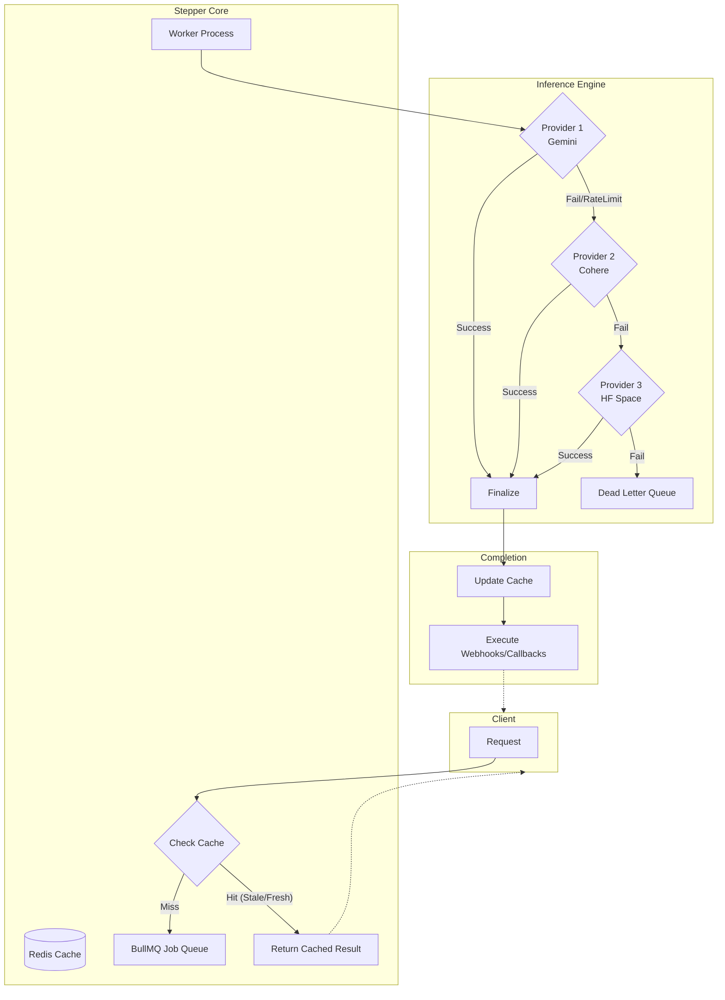

# Stepper: Production-Grade AI Inference Orchestrator

[](https://github.com/samuel-adedigba/ai-inference-stepper/actions)
[](https://www.npmjs.com/package/ai-inference-stepper)
[](https://www.npmjs.com/package/ai-inference-stepper)
[](#license)
[](https://www.typescriptlang.org/)

**Stepper** is a resilient, multi-provider AI inference engine designed for high-load production environments. It handles provider fallbacks, intelligent caching, job queuing, and circuit breaking out of the box.

- Back to root: [../../README.md](../../README.md)
- CommitDiary packages: [../api/README.md](../api/README.md) • [../web-dashboard/README.md](../web-dashboard/README.md) • [../extension/README.md](../extension/README.md) • [../core/README.md](../core/README.md)

## npm Usage (Library or Service)

Install:

```bash
npm i ai-inference-stepper
```

Library usage:

```typescript
import { enqueueReport, registerCallbacks, initStepper } from "ai-inference-stepper";

initStepper({
  config: {
    redis: { url: "redis://localhost:6379" },
  },
});

registerCallbacks({
  onSuccess: (jobId, provider) => console.log(`Generated via ${provider}`),
});
```

Service usage (CLI):

```bash
npx ai-inference-stepper
```

## Standalone Setup (Local)

Stepper is open source and can run independently or inside this monorepo.

### Prerequisites

- Node.js 18+
- pnpm
- Redis (required)

### Install

```bash
cd packages/stepper
pnpm install
```

### Configure

```bash
cp .env.example .env
```

Add at least one provider key and Redis config in .env.

### Run

```bash
docker run -d -p 6379:6379 redis:alpine
pnpm dev
```

### Why This Setup Works

- Redis backs cache and queue state for resilient processing
- Provider adapters allow fallback across multiple AI vendors
- Callbacks let CommitDiary save reports and notify users reliably

---

## Architecture

Understanding how Stepper handles your requests is key to using its full power.



### The Core Flow

1.  **Request Capture**: Received via HTTP or internal Library Call.
2.  **Smart Caching**: Checks Redis. Supports **Stale-While-Revalidate** (returns stale data while refreshing in background).
3.  **Job Queueing**: If not cached, the request is enqueued via **BullMQ** to prevent overloading providers.
4.  **Resilient Orchestration**:
    - **Priority Fallback**: Tries Gemini → Cohere → HF Space in sequence.
    - **Circuit Breakers**: Stops calling failing providers to allow them to recover.
    - **Rate Limiting**: Per-provider bottlenecking to respect API quotas.
5.  **Finalize**: Result is cached, and `onSuccess` callbacks are triggered.

> [!TIP]
> For a deep dive into the system design, see [ARCHITECTURE.md](./ARCHITECTURE.md).

---

## Real-World Use Case: CommitDiary

Stepper powers **CommitDiary**, an automated commit message generation tool.

**The Problem:** Developers often write vague commit messages like "fix bug" or "update code".
**The Solution:** CommitDiary analyzes the git diff and uses Stepper to generate a professional, descriptive commit message.

**How it works in production:**
1.  **Input**: VS Code Extension sends the `git diff` to Stepper.
2.  **Process**: Stepper uses the configured AI provider (e.g., Gemini) to analyze the code changes.
3.  **Output**: Returns a summary, a detailed list of changes, and a short commit message title.
4.  **Reliability**: If the primary AI provider is down, Stepper automatically falls back to secondary providers ensuring the user always gets a generated message.

---

## CommitDiary Integration Flow


### How CommitDiary Uses Stepper

- API calls Stepper to generate commit reports
- Stepper returns a jobId or cached result
- Stepper posts back to API callbacks for delivery and persistence

See API docs for endpoints and callbacks: [../api/README.md](../api/README.md)

---

## Component Deep Dives

Stepper is modular. Explore each subsystem's technical documentation:

| Component         | Purpose                          | Technical Details                           |
| :---------------- | :------------------------------- | :------------------------------------------ |
| **Cache**         | Intelligent Redis strategies     | [Cache Guide](./src/cache/README.md)        |
| **Providers**     | Adapter logic for different LLMs | [Provider Specs](./src/providers/README.md) |
| **Queue**         | Background processing & retries  | [Queue System](./src/queue/README.md)       |
| **Metrics**       | Prometheus & Observability       | [Metrics Docs](./src/metrics/README.md)     |
| **Alerts**        | Discord & error notifications    | [Alerts System](./src/alerts/README.md)     |
| **Validation**    | Zod-based strict output parsing  | [Validation](./src/validation/README.md)    |

### Provider-Specific Optimizations

#### Google Gemini (Gemini 3 Models)

Stepper includes specialized optimizations for Google's Gemini 3 models based on [official Google prompting strategies](https://ai.google.dev/gemini-api/docs/prompting-strategies).

**Why Gemini is Different:**
- **XML-Structured Prompts**: Uses `<role>`, `<instructions>`, `<context>`, `<task>` tags for better model understanding
- **Query Parameter Authentication**: API key passed in URL (`?key=YOUR_KEY`) instead of headers
- **Locked Temperature**: Must use `temperature: 1.0` (Google requirement for optimal Gemini 3 performance)
- **Increased Token Limit**: 4096 tokens for detailed analysis

**Conditional Implementation:**
```typescript
if (provider === 'gemini') {
    // Use XML-structured prompt
    prompt = buildGeminiPrompt(input);
    // Append API key to URL
    endpoint = `${endpoint}?key=${apiKey}`;
}
```

This pattern allows each provider to have unique optimizations while maintaining clean code separation. See [Provider Documentation](./src/providers/README.md#-provider-specific-implementations) for details.

---

## Quick Start (3 Minutes)

### 1. Install Dependencies

```bash
pnpm install
```

### 2. Configure Environment

Copy the example and add your API keys:

```bash
cp .env.example .env
```

### 3. Spin Up Redis & Stepper

```bash
# Start Redis (Required)
docker run -d -p 6379:6379 redis:alpine

# Start in Dev Mode
pnpm dev
```

---

## Monorepo Notes

- API expects Stepper at STEPPER_URL (default http://localhost:3005)
- If running inside the monorepo, keep API and Stepper dev servers up
- See root setup guide: [../../README.md](../../README.md)

---

## Usage Modes

### Mode A: As a Library (Direct Integration)

Best for monorepos or when you want to avoid network overhead.

```typescript
import { enqueueReport, registerCallbacks, initStepper } from "ai-inference-stepper";

// Optional: programmatic config overrides (no env file required)
initStepper({
  config: {
    redis: { url: "redis://localhost:6379" },
  },
  providers: [
    { name: "gemini", enabled: true, apiKey: process.env.GEMINI_API_KEY, baseUrl: "https://generativelanguage.googleapis.com/v1", modelName: "gemini-pro", concurrency: 2, rateLimitRPM: 5 }
  ]
});

// 1. Setup notification logic
registerCallbacks({
  onSuccess: (id, provider, data) => console.log(`Success via ${provider}`),
  onFailure: (id, errors) => console.error("Failed:", errors),
});

// 2. Trigger a request (returns immediately if queued or cached)
const result = await enqueueReport({
  commitSha: "abc123",
  message: "Fix bug",
  // ...other input
});
```

### Mode B: As an HTTP Service

Best for microservices or remote deployments (Render/Railway).

```bash
# Send a report generation request
curl -X POST http://localhost:3001/v1/reports \
  -H "Content-Type: application/json" \
  -d '{ "message": "Refactor API", "files": ["src/app.ts"] }'
```

#### CLI (npm)

```bash
# One-off run
npx ai-inference-stepper

# Or install and run
npm i -g ai-inference-stepper
ai-inference-stepper
```

#### Environment Setup (Service Mode)

Stepper reads config from environment variables. Use .env for local runs:

```bash
cp .env.example .env
```

If you install Stepper as a library, you can either:
- Provide env variables in your host app process (recommended for deployments), or
- Call `initStepper({ config, providers })` programmatically to override defaults.

```
# Response gives you a JobID to poll
# { "status": "queued", "jobId": "...", "statusUrl": "..." }
```

---

## Contributing & Community

We love contributors! Whether it's a bug report or a new provider adapter:

- **Issues**: Found a bug? [Raise an issue](https://github.com/samuel-adedigba/ai-inference-stepper/issues).
- **Pull Requests**: Have a fix? [Open a PR](https://github.com/samuel-adedigba/ai-inference-stepper/pulls).

If contributing inside the CommitDiary monorepo, start at [../../README.md](../../README.md) for the full workflow.

---

## License

**Custom Attribution License**

You are free to use, modify, and distribute this software for personal or commercial projects, provided that:

1.  **Credit is given**: You must attribute the original work to **Samuel Adedigba (@samuel-adedigba)**.
2.  **Pull Requests**: Contributions and improvements are encouraged back to this core repository.

_For full details, see the [LICENSE](./LICENSE) file (MIT-based with attribution)._
