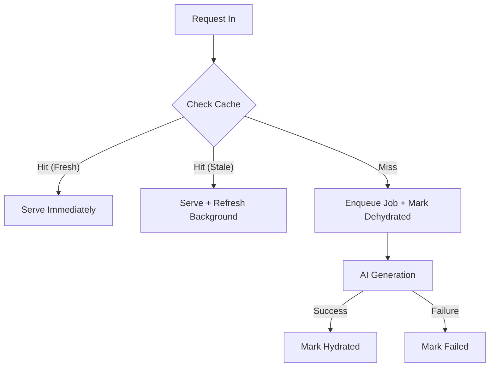

# 🧠 Cache System

The **Inference Stepper** package is designed to generate AI-powered "commit diary" reports. Since generating these reports using AI services (like Gemini, Cohere, etc.) takes time and costs money, this module implements a **Redis-backed caching system**.

## 🎯 Purpose

1. **Remember** reports that were already generated
2. **Return them instantly** when requested again
3. **Track the progress** of reports being generated
4. **Handle failures** gracefully

## 🔑 Key Concepts

### Dehydrated vs. Hydrated

- **Dehydrated entry**: A placeholder in the cache saying "We're working on this report, come back later!". It contains a `jobId` to track progress.
- **Hydrated entry**: A completed report ready to be served. It contains the actual AI-generated content and metadata about which providers were tried.

### Stale-While-Revalidate

This system implements the **Stale-While-Revalidate** pattern:

1. Serve old (stale) data immediately to the user.
2. Trigger a background refresh to generate fresh data.
3. The next request gets the updated, fresh data.

## 📋 Functions

| Function             | Purpose                                                                       |
| -------------------- | ----------------------------------------------------------------------------- |
| `getRedisClient()`   | Manages the connection to the Redis database.                                 |
| `buildCacheKey()`    | Creates unique identifiers like `stepper:report:user123:shaabc`.              |
| `getReportCache()`   | Retrieves a cached report if it exists.                                       |
| `setDehydrated()`    | Marks a report as "in progress".                                              |
| `setHydrated()`      | Stores a completed AI report.                                                 |
| `markFailed()`       | Records logic failures so we don't keep retrying broken requests immediately. |
| `isHydratedFresh()`  | Checks if a report is young enough to serve without refresh.                  |
| `isStaleButUsable()` | Checks if we can serve an old report while refreshing.                        |

## 🎯 Flow

